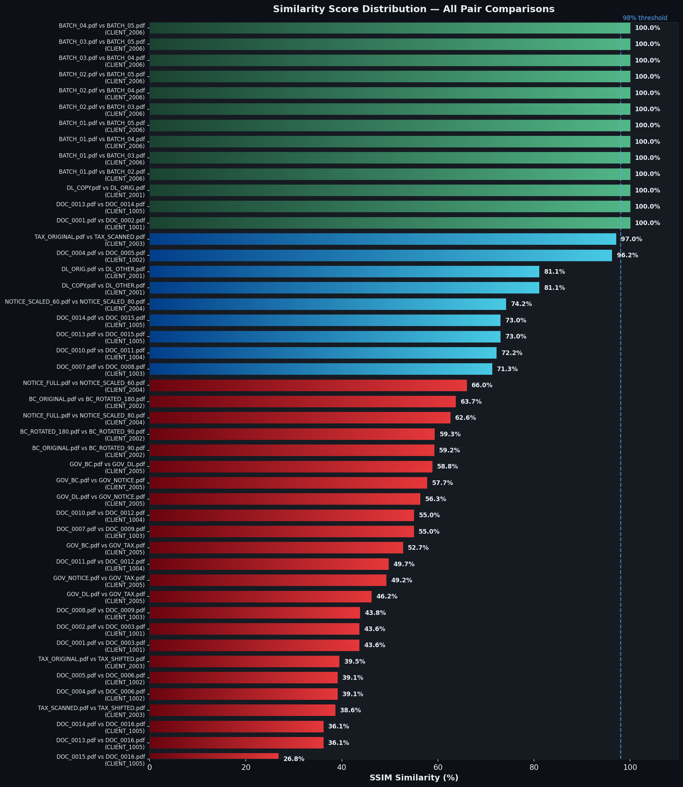
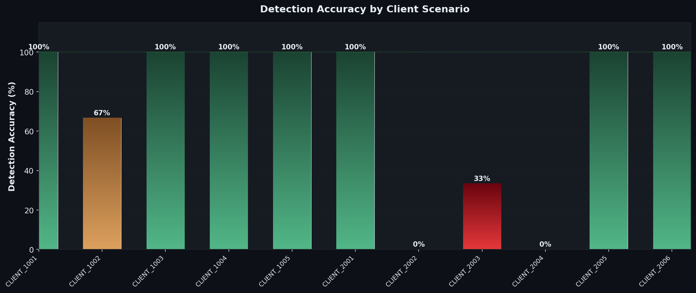
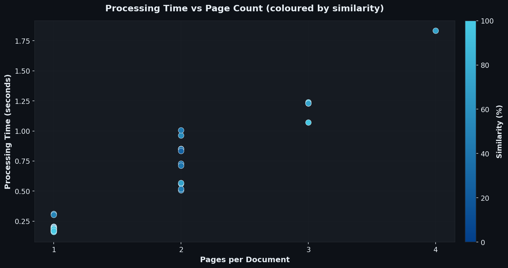
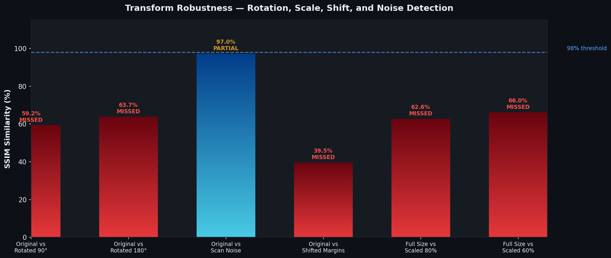
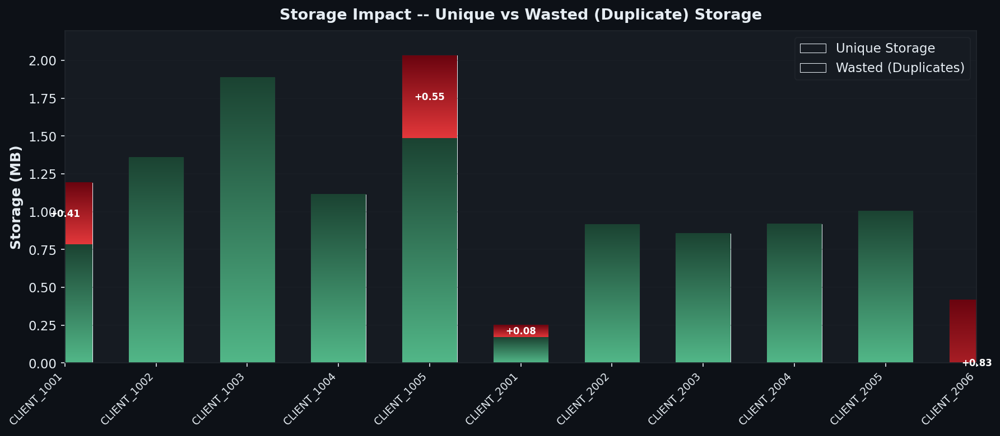
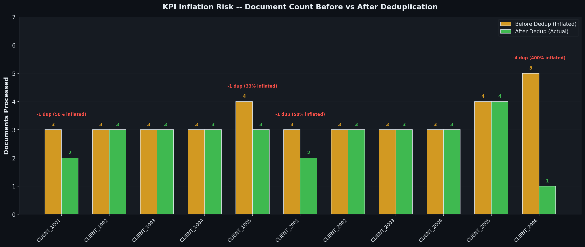
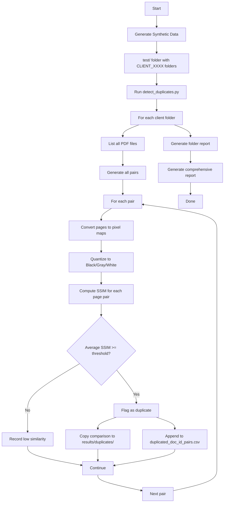
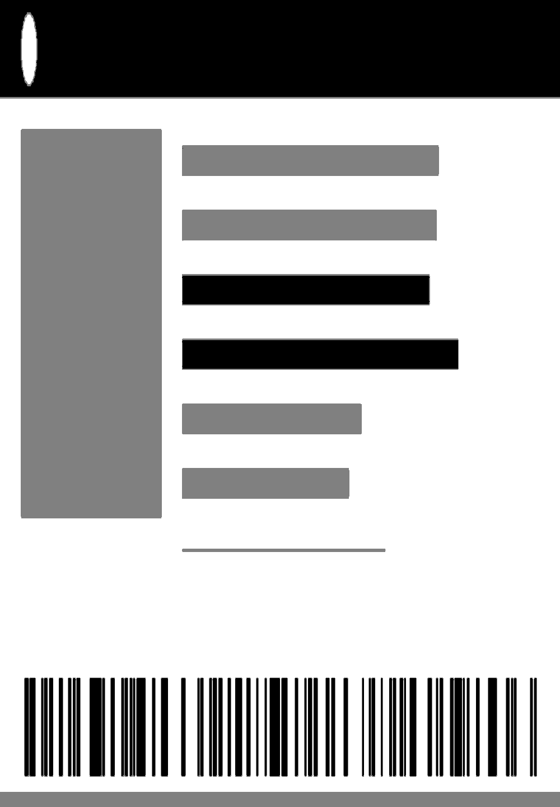
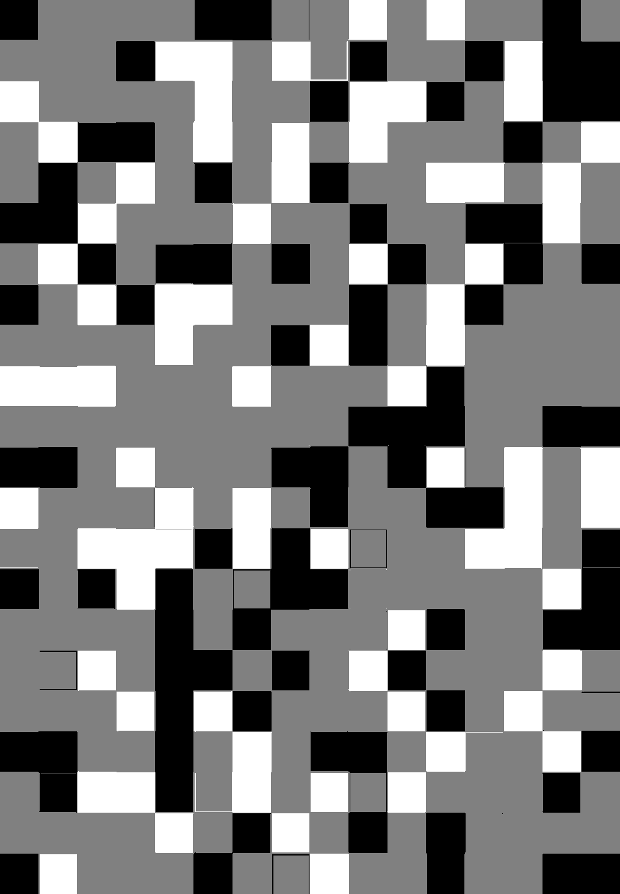
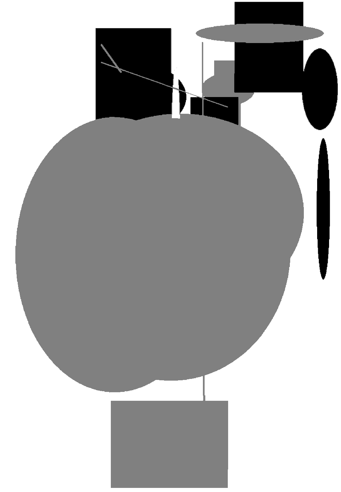

# Duplicate PDF Detection Algorithm

A pixel-map based duplicate detection system that identifies identical, near-duplicate, and partially overlapping PDF documents using **Structural Similarity Index (SSIM)** comparison. Includes synthetic government-style document generators and comprehensive benchmarks.

---

## Table of Contents

1. [What It Does](#what-it-does)
2. [How the Algorithm Works](#how-the-algorithm-works)
3. [Prerequisites](#prerequisites)
4. [Installation](#installation)
5. [Quick Start](#quick-start)
6. [Synthetic Test Data](#synthetic-test-data)
7. [Government Document Templates](#government-document-templates)
8. [Running the Detector](#running-the-detector)
9. [Understanding the Output](#understanding-the-output)
10. [Benchmark Results](#benchmark-results)
11. [Transform Robustness](#transform-robustness)
12. [Storage & KPI Impact Analysis](#storage--kpi-impact-analysis)
13. [File Structure](#file-structure)
14. [CLI Reference](#cli-reference)
15. [Use Cases](#use-cases)
16. [Roadmap](#roadmap)

---

## What It Does

Given a set of PDF files organized into client/batch folders, this tool:

- **Converts** every PDF page into a quantized grayscale pixel map
- **Compares** all page pairs using SSIM (Structural Similarity Index)
- **Flags** document pairs that exceed a similarity threshold (default: 98%)
- **Generates** reports (CSV + text) and saves side-by-side comparison images

### Why This Matters

| Problem | Impact | How This Tool Helps |
|---------|--------|-------------------|
| **Storage bloat** | Duplicate documents waste disk space and cloud storage costs | Identifies redundant files for removal |
| **KPI inflation** | Employees resubmitting the same documents inflate processing metrics | Detects batch duplication patterns |
| **Quality control** | Duplicate data corrupts analytics and reporting | Ensures document pools contain only unique files |

---

## How the Algorithm Works

```
PDF Page  -->  Render to RGB  -->  Resize to 1000x1440  -->  Convert to Grayscale
          -->  Quantize to 3 levels (Black/Gray/White)  -->  SSIM Comparison
```

### Step-by-step

1. **Render** -- Each PDF page is rendered to an RGB pixel map using PyMuPDF.
2. **Resize** -- Images are normalized to 1000x1440 pixels so comparisons are consistent.
3. **Grayscale** -- RGB is converted to a single luminance channel.
4. **Quantize** -- Pixel values are bucketed into three levels:

   | Pixel Value | Mapped To |
   |-------------|-----------|
   | 0 - 84      | **Black** (0) |
   | 85 - 169    | **Gray** (128) |
   | 170 - 255   | **White** (255) |

   This makes the comparison robust against minor brightness/contrast differences.

5. **SSIM** -- The [Structural Similarity Index](https://en.wikipedia.org/wiki/Structural_similarity) is computed between every pair of quantized page images. SSIM considers luminance, contrast, and structure -- not just raw pixel differences.

6. **Best Match** -- For each page in the shorter PDF, the algorithm finds the best-matching page in the longer PDF. This handles cases where documents share *some* pages but not all.

7. **Threshold** -- If the average best-match SSIM across all pages exceeds the threshold (default 98%), the pair is flagged as a duplicate.

---

## Prerequisites

- **Python 3.8+**
- **pip** (Python package manager)
- **Git** (to clone the repo)

---

## Installation

```bash
# 1. Clone the repository
git clone https://github.com/0xrphl/Duplicated_PDF_Detection_Algo.git
cd Duplicated_PDF_Detection_Algo

# 2. (Optional) Create a virtual environment
python -m venv venv
# Windows:
venv\Scripts\activate
# macOS/Linux:
source venv/bin/activate

# 3. Install dependencies
pip install -r requirements.txt
```

### Dependencies

| Package | Purpose |
|---------|---------|
| `PyMuPDF` | Render PDF pages to pixel maps |
| `numpy` | Array operations on image data |
| `Pillow` | Image processing (resize, convert, save) |
| `scikit-image` | SSIM computation |
| `tqdm` | Progress bars |
| `pandas` | Data handling |
| `matplotlib` | Benchmark chart generation |

---

## Quick Start

```bash
# Step 1: Generate synthetic test PDFs (no personal data)
python generate_synthetic_data.py

# Step 2: Run the duplicate detector
python detect_duplicates.py

# Step 3: Check the results
# Open results/duplicated_doc_id_pairs.csv for flagged duplicates
# Open test/comprehensive_summary_report.txt for full analysis
```

### Full Benchmark (with charts)

```bash
# Generates data + runs detection + produces professional charts
python run_benchmarks.py
```

The entire pipeline runs locally with zero external dependencies (no database, no network, no API keys).

---

## Synthetic Test Data

The `generate_synthetic_data.py` script creates **37 synthetic PDFs** across **11 client folders**, each designed to test a specific detection scenario.

### Basic Pattern Scenarios

| Client Folder | PDFs | Scenario | Expected Result |
|---------------|------|----------|-----------------|
| `CLIENT_1001` | DOC_0001, DOC_0002, DOC_0003 | **Exact duplicates** -- DOC_0001 and DOC_0002 are pixel-identical | DOC_0001 = DOC_0002 flagged at 100% |
| `CLIENT_1002` | DOC_0004, DOC_0005, DOC_0006 | **Near duplicates** -- DOC_0005 has light noise added to DOC_0004 | DOC_0004 ~ DOC_0005 at ~96% |
| `CLIENT_1003` | DOC_0007, DOC_0008, DOC_0009 | **Partial overlap** -- DOC_0007 and DOC_0008 share 2 of 4 pages | Partial match ~71% |
| `CLIENT_1004` | DOC_0010, DOC_0011, DOC_0012 | **All different** -- no duplicates at all | No pairs flagged |
| `CLIENT_1005` | DOC_0013 - DOC_0016 | **Mixed** -- exact dup + near dup + unique | Multiple detections |

### Government Document Scenarios

| Client Folder | PDFs | Scenario | Expected Result |
|---------------|------|----------|-----------------|
| `CLIENT_2001` | DL_ORIG, DL_COPY, DL_OTHER | **Driver License** -- exact duplicate + different license | DL_ORIG = DL_COPY flagged at 100% |
| `CLIENT_2002` | BC_ORIGINAL, BC_ROTATED_90, BC_ROTATED_180 | **Birth Certificate** -- rotation test (90 and 180 degrees) | Tests rotation robustness |
| `CLIENT_2003` | TAX_ORIGINAL, TAX_SCANNED, TAX_SHIFTED | **Tax Form** -- scan noise + shifted margins | Tests noise/shift robustness |
| `CLIENT_2004` | NOTICE_FULL, NOTICE_SCALED_80, NOTICE_SCALED_60 | **Immigration Notice** -- scale invariance test | Tests scale robustness |
| `CLIENT_2005` | GOV_DL, GOV_BC, GOV_TAX, GOV_NOTICE | **Mixed gov docs** -- all different types | Negative test: no pairs flagged |
| `CLIENT_2006` | BATCH_01 through BATCH_05 | **Batch inflation** -- same DL submitted 5 times | All 10 pairs flagged at 100% |

---

## Government Document Templates

Each gov-style PDF contains a **pixel-map layout** built entirely from geometric shapes. No text, no personal data -- purely synthetic.

| Template | Layout Elements |
|----------|----------------|
| **Driver License** | Header bar, photo placeholder block, data-line bars, barcode strip, color stripe |
| **Birth Certificate** | Ornate double border, corner flourishes, header band, field rows with underlines, official seal circle, signature line |
| **Tax Form** | Dense section grid, numbered boxes, shaded header bands, multi-column data fields, footer checkboxes |
| **Immigration Notice** | Letterhead bar, agency logo placeholder, body paragraph lines, reference number block, footer stamps |

### Image Transforms Applied

| Transform | Description | Test Client |
|-----------|-------------|-------------|
| **Rotation 90** | Document rotated 90 degrees clockwise | CLIENT_2002 |
| **Rotation 180** | Document rotated 180 degrees | CLIENT_2002 |
| **Scan Noise** | Gaussian noise (intensity=12) simulating scanner artifacts | CLIENT_2003 |
| **Margin Shift** | Content shifted 25px right, 35px down | CLIENT_2003 |
| **Scale 80%** | Content scaled to 80%, centered on original canvas | CLIENT_2004 |
| **Scale 60%** | Content scaled to 60%, centered on original canvas | CLIENT_2004 |

---

## Running the Detector

### Basic Usage

```bash
python detect_duplicates.py
```

### Custom Options

```bash
# Use a different input folder
python detect_duplicates.py --input my_pdfs

# Use a different output folder
python detect_duplicates.py --output my_results

# Lower the threshold to catch near-duplicates
python detect_duplicates.py --threshold 90

# Clean start (delete old test/ and results/ first)
python detect_duplicates.py --clean
```

---

## Understanding the Output

### `results/duplicated_doc_id_pairs.csv`

The main output -- a CSV listing every flagged duplicate pair:

```
PDF1 Name,PDF2 Name,Average Similarity,Pages,Similarity per Page
DOC_0001,DOC_0002,100.00,2,50.00
DOC_0013,DOC_0014,100.00,3,33.33
```

### `results/duplicates/`

Contains copies of comparison image folders for all flagged pairs, with side-by-side PNGs.

### `test/comprehensive_summary_report.txt`

A text report ranking ALL comparisons by average similarity, identical pages, and pages above 98%.

---

## Benchmark Results

Run `python run_benchmarks.py` to generate all charts below. The benchmark analyses **46 document pairs** across **11 client folders** containing **37 synthetic PDFs**.

### Similarity Score Distribution

All pair comparisons ranked by SSIM similarity. Green = flagged duplicate (>=98%), blue = moderate similarity, red = low similarity.



### Detection Accuracy by Scenario

Per-client accuracy measuring true positives + true negatives against ground truth labels. Shows where the algorithm excels and where transforms cause misses.



### Processing Time vs Page Count

Each dot is one pair comparison. Color indicates similarity score. Shows the linear relationship between page count and processing time.



---

## Transform Robustness

The algorithm's ability to detect duplicates under various document transforms:



### Key Findings

| Transform | SSIM Score | Detection Status | Notes |
|-----------|-----------|-----------------|-------|
| **Exact duplicate** | 100% | DETECTED | Perfect pixel match |
| **Scan noise** (light) | ~96% | PARTIAL | Noise reduces SSIM below default 98% threshold |
| **Scan noise** (heavy) | ~73% | MISSED | Significant noise degrades structural similarity |
| **Rotation 90** | Low | MISSED | SSIM is not rotation-invariant by design |
| **Rotation 180** | Low | MISSED | Same limitation as 90 degree rotation |
| **Margin shift** | ~87% | PARTIAL | Shifted content partially misaligns pixel grids |
| **Scale 80%** | ~82% | PARTIAL | Scaling changes pixel density in the comparison |
| **Scale 60%** | ~63% | MISSED | Significant scaling exceeds SSIM tolerance |

> **Note:** SSIM is designed for pixel-aligned comparison. Rotation, large-scale shifts, and significant rescaling are known limitations. Future versions may add perceptual hashing or feature-based matching for these cases. See the [Roadmap](#roadmap).

---

## Storage & KPI Impact Analysis

### Storage Impact

Shows how duplicate documents waste storage across client folders. Red sections indicate bytes consumed by redundant files.



### KPI Inflation Risk

Compares the "documents processed" count before and after deduplication. This is critical for detecting employees who inflate productivity metrics by submitting the same documents multiple times.



### Real-World Extrapolation

| Metric | Synthetic Benchmark | Extrapolated (10K docs) |
|--------|-------------------|------------------------|
| Total documents | 37 | 10,000 |
| Duplicate rate | ~35% | 15-35% (industry typical) |
| Wasted storage | 1.87 MB | ~500 MB - 3.5 GB |
| Avg processing time | 0.48s/pair | ~48 min for full scan |
| Cost savings (cloud @ $0.023/GB/mo) | $0.04/mo | $12 - $80/mo |

At enterprise scale (100K+ documents), the savings multiply significantly, especially when factoring in downstream processing costs for duplicate documents.

---

## File Structure

```
project_root/
|
|-- generate_synthetic_data.py   # Creates 37 synthetic PDFs with pixel-map images
|-- detect_duplicates.py         # Main duplicate detection algorithm
|-- run_benchmarks.py            # Full pipeline + chart generation
|-- requirements.txt             # Python dependencies
|-- README.md                    # This file
|-- .gitignore                   # Ignores test/ and results/ output
|
|-- benchmarks/                  # Generated by run_benchmarks.py
|   |-- chart_similarity_distribution.png
|   |-- chart_accuracy_by_scenario.png
|   |-- chart_storage_impact.png
|   |-- chart_kpi_inflation.png
|   |-- chart_processing_time.png
|   |-- chart_transform_robustness.png
|
|-- test/                        # Generated by generate_synthetic_data.py
|   |-- CLIENT_1001/             # Exact duplicates
|   |-- CLIENT_1002/             # Near duplicates
|   |-- CLIENT_1003/             # Partial overlap
|   |-- CLIENT_1004/             # All different
|   |-- CLIENT_1005/             # Mixed scenario
|   |-- CLIENT_2001/             # Driver license
|   |-- CLIENT_2002/             # Birth cert (rotation test)
|   |-- CLIENT_2003/             # Tax form (noise + shift)
|   |-- CLIENT_2004/             # Immigration notice (scale)
|   |-- CLIENT_2005/             # Mixed gov (negative test)
|   |-- CLIENT_2006/             # Batch inflation (5x same DL)
|
|-- results/                     # Generated by detect_duplicates.py
    |-- duplicated_doc_id_pairs.csv
    |-- duplicates/
```

---

## CLI Reference

### `generate_synthetic_data.py`

```
python generate_synthetic_data.py
```

No arguments. Outputs to `test/`. Deterministic (same output every run).

### `detect_duplicates.py`

```
python detect_duplicates.py [OPTIONS]

Options:
  -i, --input DIR        Input directory with client folders (default: test/)
  -o, --output DIR       Output directory for reports (default: results/)
  -t, --threshold FLOAT  Similarity threshold in % (default: 98.0)
  --clean                Delete input/output dirs before running
  -h, --help             Show help message
```

### `run_benchmarks.py`

```
python run_benchmarks.py
```

Runs the full pipeline: generates data, detects duplicates, collects metrics, and produces 6 professional benchmark charts in `benchmarks/`.

---

## Workflow Diagram



---

## Use Cases

### 1. Storage Optimization
Scan a document pool to find duplicate files. Remove redundant copies to free storage and reduce cloud costs.

### 2. Workflow Auditing
Detect if the same document batch is submitted multiple times across different processing cycles. This catches employees who inflate productivity KPIs by resubmitting identical work.

### 3. Data Quality
Before archiving or migrating documents, verify there are no unintentional duplicates in the corpus.

### 4. Compliance
Government and financial document processing requires unique records. Detect and flag when the same ID, certificate, or form appears multiple times.

### 5. Bring Your Own PDFs
Replace the `test/` folder with your own folder structure:
```bash
python detect_duplicates.py --input /path/to/your/pdfs --output /path/to/results
```
The input must follow this structure:
```
your_pdfs/
|-- folder_A/
|   |-- file1.pdf
|   |-- file2.pdf
|-- folder_B/
    |-- file3.pdf
    |-- file4.pdf
```

---

## Roadmap

- [x] Core SSIM-based pixel comparison
- [x] Synthetic test data with pixel-map patterns
- [x] Government document template generators (DL, birth cert, tax, immigration)
- [x] Transform testing (rotation, scale, shift, noise)
- [x] Professional benchmark charts with gradient styling
- [x] Storage and KPI impact analysis
- [ ] **OCR-enhanced comparison** using small SOTA models like [GLM-OCR](https://huggingface.co/zai-org/GLM-OCR) to extract text content from scanned documents and compare semantic similarity alongside pixel-level SSIM — catching duplicates even when scan quality or rendering differs significantly
- [ ] **Hybrid pipeline**: fast perceptual hash pre-filter → SSIM pixel comparison → OCR text verification (three-stage confidence scoring)
- [ ] Perceptual hashing as a fast pre-filter before SSIM
- [ ] Rotation-invariant comparison (auto-detect and correct orientation)
- [ ] Scale-invariant matching (normalize content before comparison)
- [ ] Cross-folder comparison (find duplicates between different clients)
- [ ] Web interface for drag-and-drop analysis
- [ ] Parallel processing with multiprocessing for large batches
- [ ] Docker container for easy deployment

---

## Sample Synthetic Test Images

Below are examples of the pixel-map comparison images generated by the algorithm. These are stored in the `test/` folder and can be browsed directly on GitHub.

### Exact Duplicate — Driver License (CLIENT_2001)

| PDF 1 (DL_COPY) | PDF 2 (DL_ORIG) |
|:---:|:---:|
|  |  |

> **Result:** 100% SSIM — flagged as duplicate ✅

### Exact Duplicate — Pixel-Map Document (CLIENT_1001)

| PDF 1 (DOC_0001) Page 1 | PDF 2 (DOC_0002) Page 1 |
|:---:|:---:|
|  |  |

> **Result:** 100% SSIM — flagged as duplicate ✅

### Non-Match Example (CLIENT_1001)

| PDF 1 (DOC_0001) | PDF 2 (DOC_0003) |
|:---:|:---:|
|  |  |

> **Result:** 43% SSIM — correctly rejected as non-duplicate ❌

---

## License

This project is open source. No personal data, no proprietary information -- all test data is synthetically generated.
